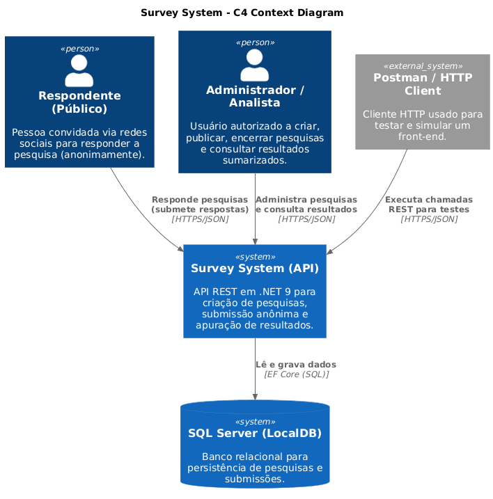
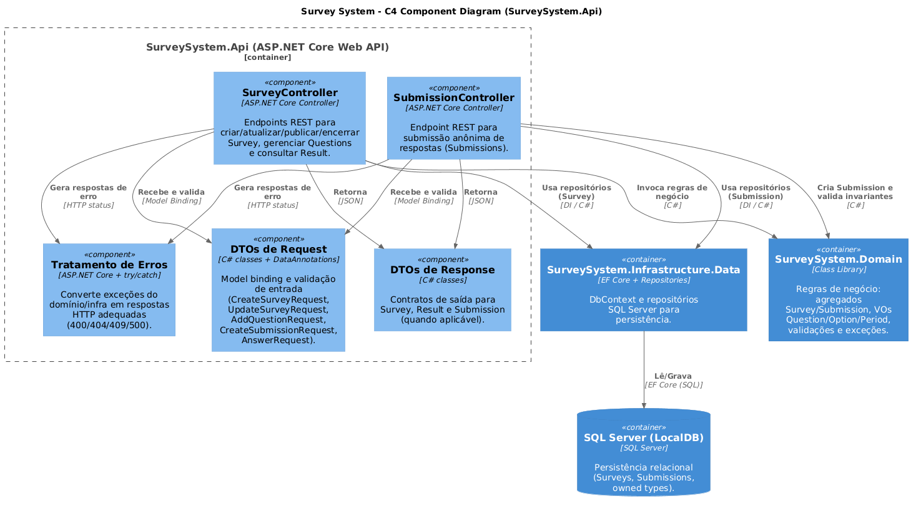
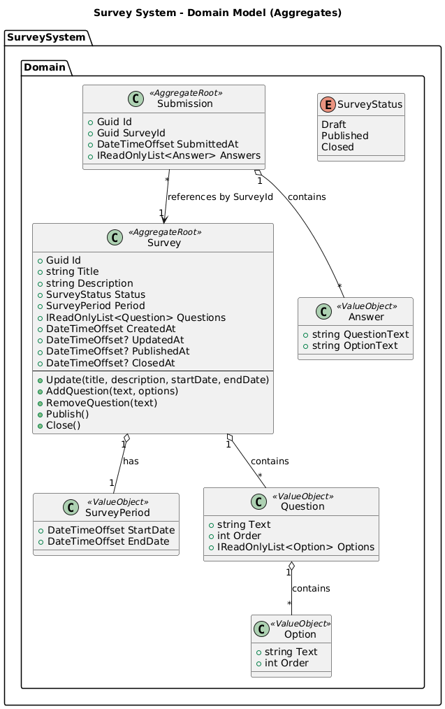

# 🚀 Sistema de Enquetes (Survey System)

## 1. Apresentação do projeto

Este projeto implementa uma **API REST** para gerenciamento de **enquetes/pesquisas públicas** (surveys) com perguntas de **múltipla escolha**, permitindo a **submissão anônima** de respostas e a **apuração sumarizada** dos resultados.  
A solução foi construída com **.NET 9 / ASP.NET Core Web API** e **Entity Framework Core**, utilizando **SQL Server LocalDB** para persistência.

### Objetivo principal e escopo

- **Objetivo**: disponibilizar uma API capaz de suportar a criação, publicação e encerramento de pesquisas, bem como o recebimento de submissões e a consulta de resultados.
- **Escopo do trabalho**: implementação de back-end com testes e documentação; **front-end foi dispensado** (ver justificativa na Rubrica 2).

### Principais funcionalidades

- Criar, atualizar, consultar e excluir pesquisas (surveys)
- Adicionar e remover questões (questions) em uma pesquisa (enquanto rascunho)
- Publicar e encerrar pesquisas
- Submeter respostas (submissions) de forma anônima
- Consultar resultado sumarizado por pesquisa

---

## 2. Arquitetura e design

A solução foi organizada em uma abordagem inspirada em **Arquitetura em Camadas / Clean Architecture**, separando responsabilidades e melhorando manutenibilidade e testabilidade:

- **SurveySystem.Domain**: regras de negócio (DDD), agregados, Value Objects e contratos de repositório
- **SurveySystem.Infrastructure.Data**: persistência com EF Core (DbContext, mapeamentos e repositórios)
- **SurveySystem.Api**: camada Web (Controllers, DTOs, validação, Swagger) e composição via DI
- **Tests**:
  - **SurveySystem.Domain.Tests**: testes das regras do domínio (xUnit + FluentAssertions)
  - **SurveySystem.Infrastructure.Data.Tests**: testes de repositórios com EF Core (provider InMemory)

### Fluxo típico de uma requisição

1. **Cliente (Postman/Swagger/UI futura)** envia requisição HTTP (JSON).
2. **API (Controller)** valida DTOs (DataAnnotations) e traduz para comandos do domínio.
3. **Domínio** executa regras de negócio (ex.: publicar, fechar, validar opções/período).
4. **Repositório (Infra)** persiste/consulta via **EF Core** no **SQL Server LocalDB**.
5. **API** devolve resposta HTTP (200/201/204/400/404/500) com DTOs de resposta.

---

## 3. Como executar

### Pré-requisitos
- Visual Studio 2022
- .NET SDK 9
- SQL Server LocalDB (ou SQL Server compatível)
- (Opcional) Postman

### String de conexão
No projeto **SurveySystem.Api**, configure `appsettings.json`:

```json
{
  "ConnectionStrings": {
    "Default": "Data Source=(localdb)\\MSSQLLocalDB;Initial Catalog=SurveySystemDb;Integrated Security=true;"
  }
}
```

### Migrações e banco
No **Package Manager Console**:

```powershell
Add-Migration Initial -Project SurveySystem.Infrastructure.Data -StartupProject SurveySystem.Api
Update-Database -Project SurveySystem.Infrastructure.Data -StartupProject SurveySystem.Api
```

### Executar a API
- Defina **SurveySystem.Api** como Startup Project
- Rode em modo Debug
- Acesse o Swagger em `http://localhost:5011/swagger/index.html`

---

## 4. Testes

- **Domínio**: `SurveySystem.Domain.Tests` (xUnit + FluentAssertions)
- **Infraestrutura**: `SurveySystem.Infrastructure.Data.Tests` com EF Core provider **InMemory** (fixture `SurveySystemRepositoryTestFixture`)

Executar:

```powershell
dotnet test
```

---

## 5. Postman

O projeto inclui uma collection do Postman:

- `Survey System - Arq. .Net - José Cláudio de Souza Jr.postman_collection.json`

Ela contém exemplos para:
- CRUD de surveys
- publicação/encerramento
- submissão de respostas
- consulta de resultados

---

# ✅ Rubricas do projeto

A seguir estão as respostas objetivas para cada rubrica exigida.

---

## 1. Arquitetar e implementar serviços com a plataforma .NET

### 1a. Componentes do .NET utilizados na solução
- **.NET 9** como plataforma base (SDK/runtime)
- **ASP.NET Core Web API** (Controllers, routing, model binding, middleware)
- **Dependency Injection (DI)** nativa do ASP.NET Core (registrada em `AddInfrastructure`)
- **Swagger/OpenAPI** via `AddSwaggerGen()` para documentação e testes manuais rápidos
- **Logging** via `ILogger<T>` nos Controllers

### 1b. Como a solução garante funcionamento e confiabilidade via componentes .NET
- **Pipeline HTTP do ASP.NET Core** com `[ApiController]` + validação de modelo
- **Tratamento de exceções** por try/catch nos Controllers para responder corretamente (400/500)
- **DI + escopo por requisição** (`AddScoped`) para repositórios e DbContext
- **Testes automatizados** (xUnit) cobrindo invariantes do domínio e operações de repositório

### 1c. Componentes que atendem aos requisitos propostos
- **Persistência**: EF Core + SQL Server LocalDB para armazenar pesquisas e submissões
- **Escalabilidade (decisão pragmática)**:
  - API stateless (escala horizontal)
  - persistência relacional para consistência e auditoria
  - endpoint de resultado sumariza as respostas por pesquisa
- **Anonimato**: submissões não armazenam dados pessoais do respondente

### 1d. Justificativa das escolhas arquiteturais
- **ASP.NET Core**: stack nativa para o time (.NET/C#), rápida para entregar com qualidade.
- **EF Core**: reduz tempo de entrega, gera migrations e integra naturalmente com .NET.
- **Arquitetura por camadas**: separa regras de negócio de infraestrutura, facilitando testes e evolução.
- **Swagger + Postman**: acelera validação funcional sem front-end (prazo curto).

---

## 2. Arquitetar e implementar sistemas Web com ASP.NET

### 2a. Componente adequado para criação do front
- O componente web adotado foi **ASP.NET Core Web API** (Controllers), pois o escopo do trabalho é back-end.
- Para um front-end futuro, a integração seria via:
  - Web App SPA (React/Angular/Vue) consumindo a API
  - ou MVC/Razor Pages consumindo serviços internos (não implementado por escopo/prazo)
  - **Minha escolha particular seria React, pois é que preciso mais me manter atualizado.**

### 2b. Linguagem adequada pensando nos stakeholders
- Para **desenvolvedores**: descrição técnica (ASP.NET Core, EF Core, DDD, DI, migrations).
- Para **usuário do sistema**: descrição funcional (criar/publicar/enviar respostas/ver resultado).
- A documentação busca equilíbrio: explica o fluxo de uso sem depender de conceitos avançados.

### 2c. Como o componente web pode ser testado
- **Swagger UI**: testes manuais rápidos (contrato HTTP, payloads e responses).
- **Postman**: collection com cenários e exemplos (incluída no repositório).

### 2d. Ao menos uma forma de testar os componentes do sistema
- **Testes unitários do domínio**: garantem invariantes (ex.: publicar/fechar, validações de dados).
- **Testes de repositório**: validam persistência e recuperação via DbContext.

---

## 3. Arquitetar e implementar acesso a dados com Entity Framework

### 3a. Componente de acesso a dados escolhido
- **Entity Framework Core** com provider **SQL Server**.

### 3b. Relação do componente de dados com o requisito
- O **DbContext (SurveySystemDbContext)** mapeia `Survey` e `Submission`.
- O EF Core mantém:
  - criação de schema via migrations
  - persistência de agregados (Survey com Questions/Options; Submission com Answers)
  - consultas para suportar o endpoint de resultado sumarizado

### 3c. Justificativa da escolha
- EF Core acelera a entrega:
  - reduz boilerplate de SQL
  - suporta migrations
  - integra com DI e ASP.NET Core nativamente
- Mantém o foco do projeto em arquitetura e domínio, sem perder pragmatismo.
- O uso do EF Core também **desacopla a aplicação do banco de dados específico**, permitindo trocar o provider com impacto mínimo no código.
- Embora neste projeto tenha sido utilizado o **Microsoft SQL Server**, a solução poderia ser facilmente adaptada para outros bancos relacionais suportados pelo EF Core, como **PostgreSQL**, **MySQL/MariaDB** ou **SQLite**, bastando alterar o provider e a string de conexão.
- Essa decisão aumenta a **flexibilidade arquitetural** e reduz riscos de lock-in tecnológico.

### 3d. Como o componente pode ser testado no diagrama/implementação
- Os testes em `SurveySystem.Infrastructure.Data.Tests` usam EF Core provider **InMemory** para validar:
  - Add/Get/Delete
  - GetAll
  - consultas por SurveyId (submissions)

---

## 4. Integração de back-end .NET com tecnologias front-end

### 4a. Relação do front-end com o back-end
- Não há front-end implementado por decisão de escopo/prazo.
- A integração está demonstrada via **cliente HTTP** (Postman/Swagger), que representa o papel do front-end.

### 4b. Justificativa da escolha do “front-end” (Postman)
- O professor permitiu dispensar UI; o prazo curto prioriza back-end e arquitetura.
- Postman permite validar:
  - contrato REST
  - payloads JSON
  - cenários de erro/sucesso
  - encadeamento de requests (criar → publicar → submeter → resultado)

### 4c. Justificativa da escolha do back-end
- **ASP.NET Core Web API** em .NET 9 foi escolhido por:
  - alinhamento com o conhecimento do time (C#/.NET)
  - produtividade e entrega rápida
  - maturidade do ecossistema (Swagger, EF Core, testes)
  - **multiplataforma**

### 4d. Protocolo de comunicação entre front e back
- **HTTP/HTTPS** com **JSON** (REST).
- Endpoints seguem padrão REST (exemplos):
  - `POST /Survey` (criar)
  - `PUT /Survey/{id}` (atualizar)
  - `POST /Survey/{id}/publish` (publicar)
  - `POST /Survey/{id}/close` (encerrar)
  - `POST /Submission?surveyId={id}` (submeter respostas)
  - `GET /Survey/{id}/result` (resultado)

---

## 6. Diagramas (C4 Model)

### 6a. Diagrama de Contexto


### 6b. Diagrama de Container


### 6c. Diagrama de Componente


## 7. Modelo de Domínio


## 7. Procedimento de Teste (Postman)

1. Abrir solution com Visual Studio
2. Compilar a solução
3. Ajustar a `ConnectionStrings` no arquivo `appsettings.json`
4. Rodar migration
  1. Abrir o `Package Manager Console`
  2. Add-Migration Initial -Project SurveySystem.Infrastructure.Data -StartupProject SurveySystem.Api
    - O resultado deve ser `Build succeeded.`
  3. Update-Database -Project SurveySystem.Infrastructure.Data -StartupProject SurveySystem.Api
    - O resultado deve ser `Done.`
5. Iniciar o debug (tem que estar com `SurveySystem.Api` como `Startup Item`)
6. Abrir o Postman
7. Importar o projeto `Survey System - Arq. .Net - José Cláudio de Souza Jr.postman_collection.json` (disponível na raiz do repositório).
8. Executar o request `Survey - Create - Eleições Estaduais`, o response esperado é `201 - Created` com retorno da enquete criada.
9. Executar o request `Survey - Create - Eleições Presidenciais`, o response esperado é `201 - Created` com retorno da enquete criada.
10. Executar o request `Survey - Get All`, o response esperado é `200 - OK` com todas as enquetes criadas.
11. Substitui `{SurveyId}` pelo Guid da enquete `Survey - Create - Eleições Presidenciais` e executar o request `Survey - Get By Id`, o response esperado é `200 - OK` com a enquete correspondente.
12. Substitui `{SurveyId}` pelo Guid da enquete `Survey - Create - Eleições Presidenciais` e executar o request `Survey - Update`, o response esperado é `200 - OK` com a enquete corresponente atualizada.
13. Substitui `{SurveyId}` pelo Guid da enquete `Survey - Create - Eleições Presidenciais` e executar o request `Survey - Add Question`, o response esperado é `200 - OK` com a enquete corresponente atualizada com a nova questão.
14. Substitui `{SurveyId}` pelo Guid da enquete `Survey - Create - Eleições Presidenciais` e executar o request `Survey - Delete Question`, o response esperado é `200 - OK` com a enquete corresponente atualizada sem a questão removida.
15. Substitui `{SurveyId}` pelo Guid da enquete `Survey - Create - Eleições Estaduais` e executar o request `Survey - Publish`, o response esperado é `200 - OK` com a enquete corresponente atualizada com status 1 (Publicado).
15. Substitui `{SurveyId}` pelo Guid da enquete `Survey - Create - Eleições Estaduais` e executar o request `Submission - Create`, o response esperado é `201 - Created` com a submissão corresponente.
16. Executar o request `Submission - Get All`, o response esperado é `200 - OK` com todas as submissões criadas.
17. Substitui `{SubmissionId}` pelo Guid da submissão criada no passo anterior e executar o request `Submission - Get By Id`, o response esperado é `200 - OK` com a submissão correspondente.
18. Substitui `{SurveyId}` pelo Guid da enquete `Survey - Create - Eleições Estaduais` e executar o request `Survey - Get Result`, o response esperado é `200 - OK` com a enquete, suas perguntas e, dentro de cada pergunta, o total de votos e também. Dentro de cada opção votada tem a quantidade de votos corresponentes e o percentual de votos perante todos os votos da questão corresponente.
19. Substitui `{SurveyId}` pelo Guid da enquete `Survey - Create - Eleições Estaduais` e executar o request `Survey - Close`, o response esperado é `200 - OK` com a enquete corresponente atualizada com status 2 (Encerrado).
20. [OPCIONAL] Substitui `{SurveyId}` pelo Guid da enquete `Survey - Create - Eleições Estaduais` e executar o request `Survey - Delete`, o response esperado é `204 - No Content`.
21. [OPCIONAL] Executar o request `Survey - Delete All`, o response esperado é `204 - No Content`.
22. [OPCIONAL] Executar o request `Submission - Delete All`, o response esperado é `204 - No Content`.